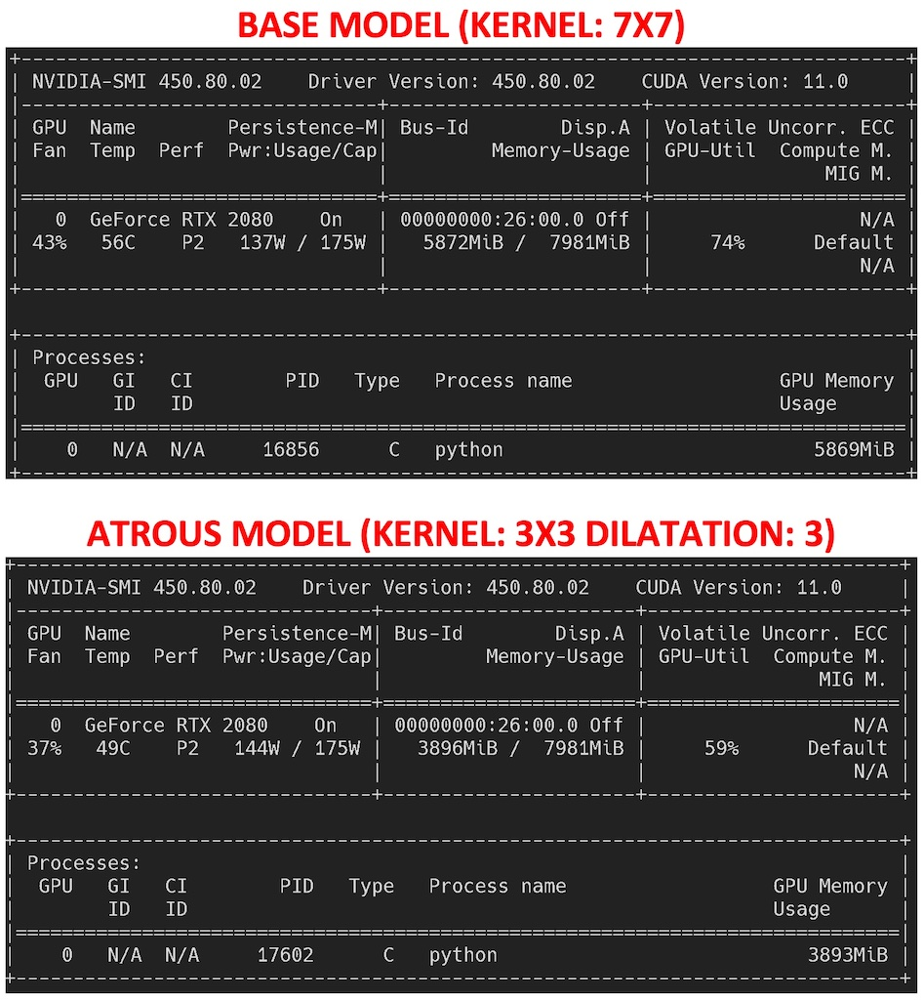

# Types of Convolution PyTorch

This repository shows a quick comparison of standard convolution and atrous convolution (also called dilated convolution).

There are two models, with the same architecture (3 conv layers and a FC layer):
- BaseModel, using convolutions with kernel 7x7
- AtrousModel, using convolutions with dilatation = 3, which produces the same feature map as a kernel 7x7.

I compared the model size, time taken to train and the train loss.

As we can see bellow, in this case the both models performs the same in respect of train loss. 

The biggest advantage of the Atrous model is the reduction in memory size (in this case almost 2GB lower) while keep the same performance of base model.

## Model size and time to train

## Time to train
- Train BASE..: 228.85 
- Train ATROUS: 212.51

## Train loss

