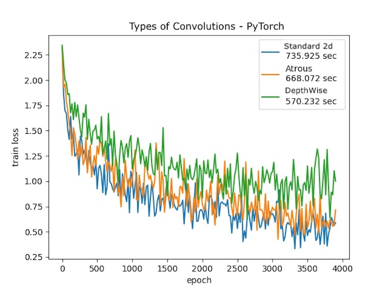
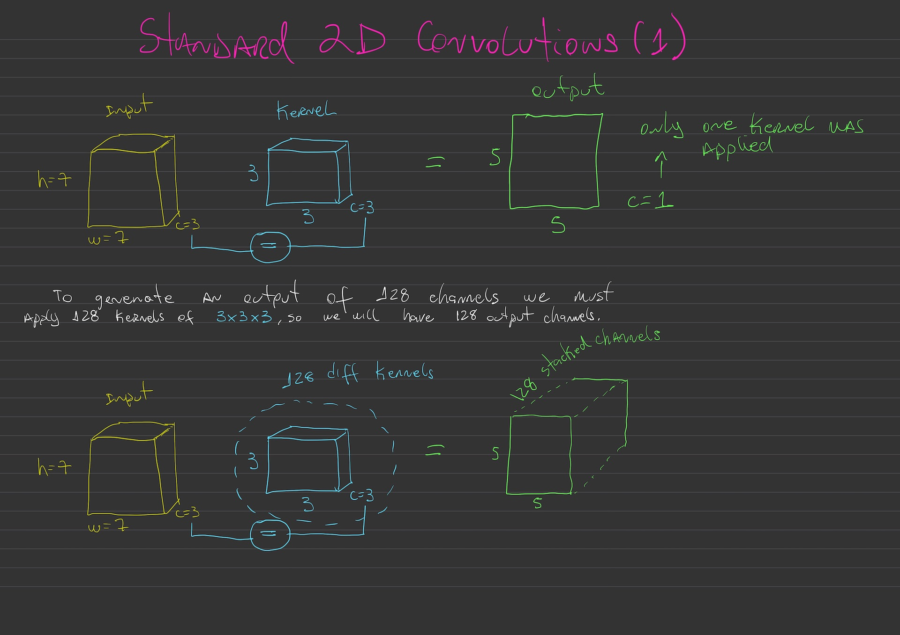
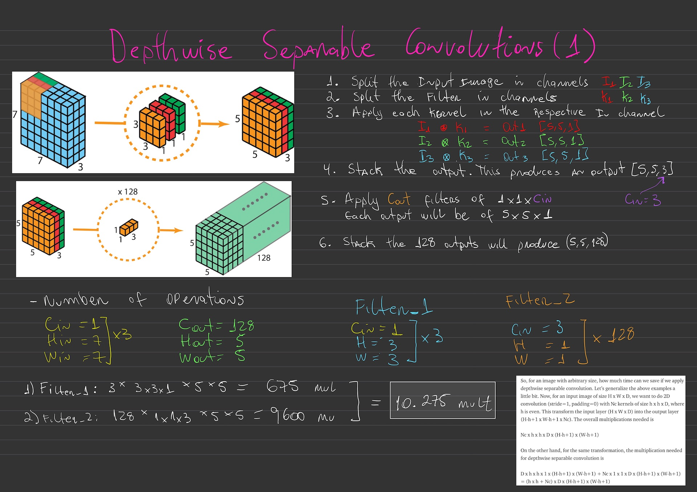

# Types of Convolution PyTorch

This repository shows a quick comparison of standard convolution and other types of convolutions.

There are two models, with the same architecture (3 conv layers and a FC layer):
- BaseModel, using convolutions with kernel 7x7
- AtrousModel, using convolutions with dilatation = 3, which produces the same feature map as a kernel 7x7.
- DepthWise convolution

I compared the model size, time taken to train and the train loss.

Dataset used is CIFAR10 which contains 60,000 images, and images are resized to 220x220 during the preprocessing phase.


## Model size and time to train

 CNN type | Time to train (sec) | # Parameters | GPU Memory | Inference Time
| --- | --- | --- | --- | --- |
| Standard 2D | 735.92 | 8,446,218 | 7154MiB |  48.46 |
| Atrous | 668.07 | 1,877,258 | 7643MiB | 37.84 |
| DepthWise | 570.23 | 582,816 | 7752MiB | 34.98 |

Observations: 
- To me it seems strange that the Standard 2D Conv uses 8x more trainable parameters than DepthWise Conv even though uses less GPU memory. I need to investigate more this.


## Train loss



## Running
Run the following command
```
pip install -r requirements.txt
```

```
python train.py
```

This will run three models and generate a image loss.jpg


## Handwritten notes




